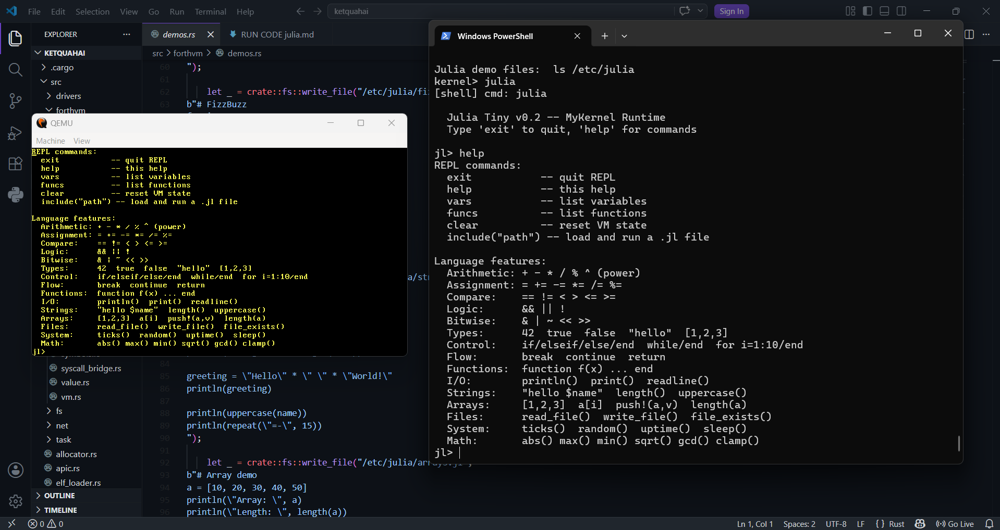
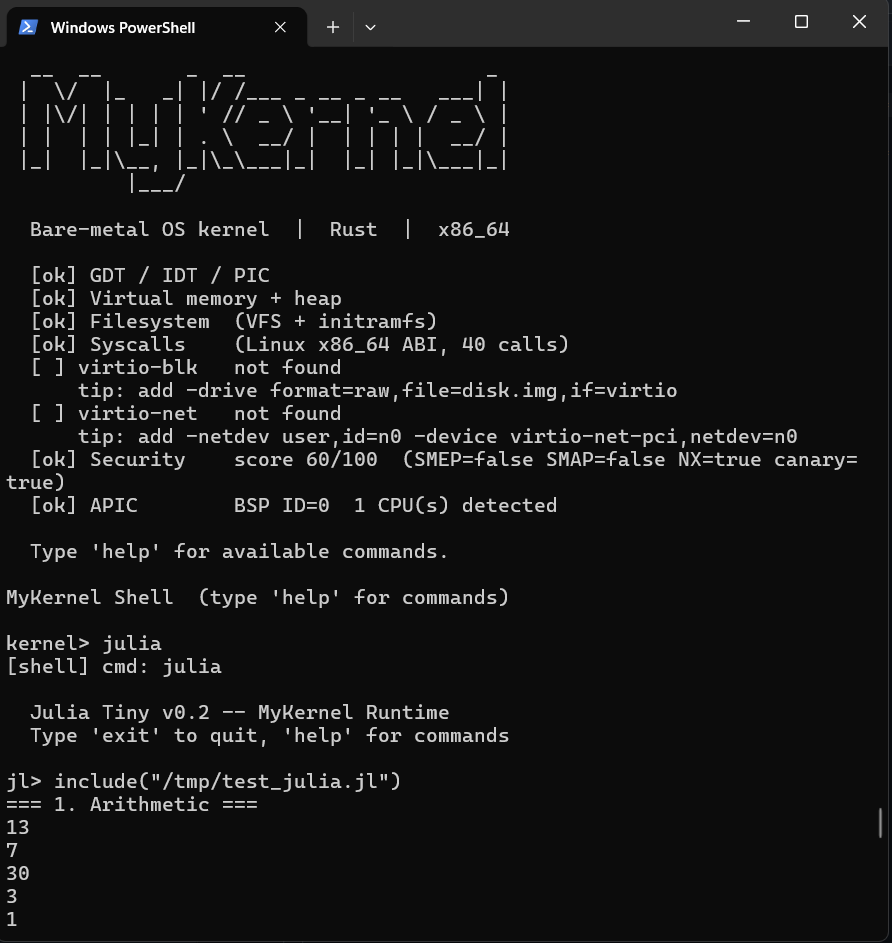

# MyKernel

Một OS kernel viết bằng Rust bare-metal trên x86_64, tích hợp máy ảo bytecode và ngôn ngữ script Julia Tiny v0.2.

```
kernel> julia
  Julia Tiny v0.2 -- MyKernel Runtime
jl> function fib(n)
...   a = 0
...   b = 1
...   k = 2
...   while k <= n
...     c = a + b
...     a = b
...     b = c
...     k += 1
...   end
...   return b
... end
jl> fib(10)
55
jl> write_file("/tmp/note.txt", "chạy trên bare-metal")
jl> read_file("/tmp/note.txt")
chạy trên bare-metal
```
 
 
---

## Dự án này là gì

Kernel tự viết từ đầu — không dùng bất kỳ OS hay runtime nào làm nền. Boot thẳng từ bootloader, chạy trên QEMU hoặc phần cứng thật.

Điểm đặc biệt: bên trong kernel có một máy ảo bytecode (ForthVM, ban đầu viết bằng Forth, sau dịch sang Rust no_std) và một ngôn ngữ Julia-like chạy trên đó. Người dùng có thể mở REPL, viết code, gọi file I/O thực sự vào filesystem của kernel — tất cả trên bare-metal.

Dự án có ba tầng lịch sử:
- **MyKernel** — OS kernel 24 phases: memory, scheduler, VFS, TCP/IP, syscalls, security
- **ForthVM** — máy ảo bytecode viết bằng Forth, có Julia Tiny compiler
- **ketquahai** (repo này) — ghép hai thứ trên lại, nâng Julia Tiny lên v0.2 với kiểu dữ liệu đầy đủ và REPL tương tác

---

## Kernel có gì

**Hạ tầng OS:**
- Boot bare-metal, 4-level paging, heap allocator (`Box`, `Vec`, `Arc` trong kernel)
- IDT, APIC, timer 100Hz, async keyboard
- Preemptive scheduler, Ring 3 user mode
- VFS layer: RamFS, DevFS, initramfs (CPIO), FAT32
- 40 Linux-compatible syscalls
- TCP/IP stack: ARP, IPv4, ICMP, UDP, TCP
- POSIX socket API
- SMP: multi-core boot, SpinLock, RwLock, SeqLock
- Security: stack canary, KASLR, pointer validation, capabilities

**Julia Tiny v0.2:**
- Kiểu dữ liệu: `Int`, `Bool`, `String`, `Array`, `Nil`
- REPL tương tác (`jl>`) với state persistent
- Load và chạy file `.jl` từ VFS
- `for` loop với range và step, `break`, `continue`
- 35 built-in functions: math, string, array, system, file I/O
- String interpolation `"hello $name"`
- Compound assignment `+=`, `-=`, `*=`, `/=`, `%=`
- File I/O thực sự vào kernel VFS

---

## Chạy thử

**Yêu cầu:**
```
rustup toolchain install nightly
rustup component add rust-src llvm-tools-preview
cargo install bootimage
```
QEMU với `qemu-system-x86_64`.

**Build và chạy:**
```bash
cargo build
cargo bootimage
qemu-system-x86_64 -drive format=raw,file=target\x86_64-mykernel\debug\bootimage-mykernel.bin -serial stdio -no-reboot
```

**Trong shell kernel:**
```
kernel> help          # danh sách lệnh
kernel> julia         # vào REPL Julia Tiny
kernel> ls /etc/julia # xem demo files có sẵn
kernel> julia /etc/julia/fizzbuzz.jl
```

---

## Nguồn gốc

ForthVM được viết độc lập bằng Forth (gforth) như một thí nghiệm kiểm soát từng byte để có ngôn ngữ Julia Tiny. Sau khi có kernel Rust riêng, toàn bộ ForthVM được dịch sang Rust no_std và cắm vào kernel như một module — tận dụng VFS, I/O, và shell sẵn có mà không làm xáo trộn bất kỳ phần nào của kernel.

Chi tiết hành trình: xem [`devlog 1.md`](devlog 1.md) và [`devlog 2.md`](devlog 2.md).

---

## Toolchain

```
rustc 1.97.0-nightly (365c0e1d7 2026-05-06)
cargo 1.97.0-nightly (4f9b52075 2026-05-01)
bootimage 0.10.4
QEMU emulator version 11.0.50 (v11.0.0-12631-g54e84cdc7a)
```

`#![no_std]` · `#![no_main]` · target `x86_64-mykernel.json`

